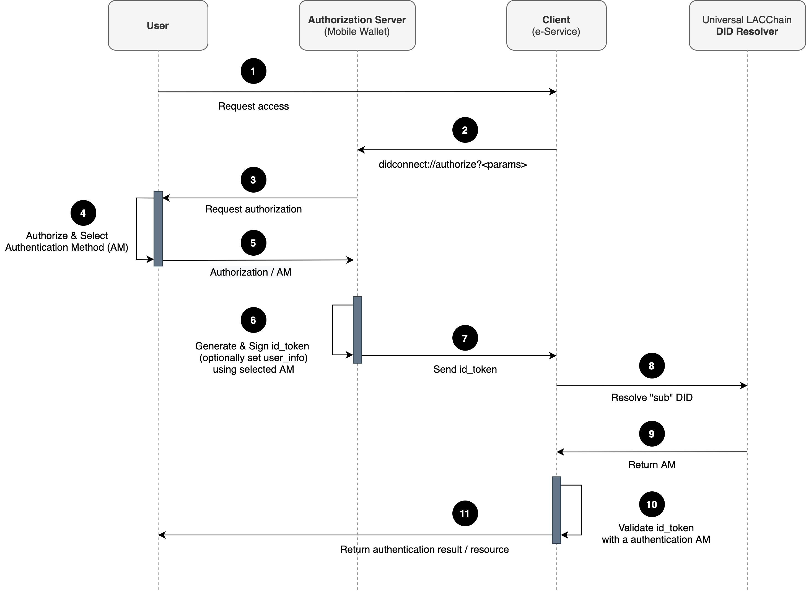
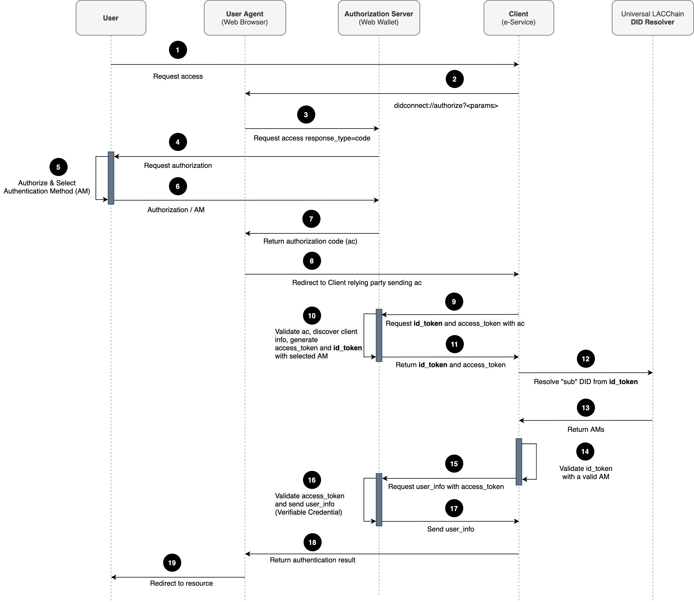

# Introduction

The LACChain service authentication methods are based on the use of a DID as an identity verification mechanism, using the public keys of a DID document to prove the identity of the entity that is in control of that DID. In this article is described a method to authenticate against the LACChain Services that can be leveraged by any electronic service operating in the LACChain ecosystem.

DID Connect is an extension to OIDC (proposed originally from [KayTrust DID Connect](https://developer.kaytrust.id/Specs/DIDConnect/)) for the use of Decentralized Identifiers (DIDs) to perform the authentication. DID Connect introduces the usage of DID and Verifiable Credentials (VCs), which is a decentralized mechanism that allows the client to verify the identity of the user. The DID should also use different public keys to choose the method to validate the user identity. It also proposes the use of VC to include information about the user in the sign-up process. 

The OpenID connect standard defines 3 [Authentication Mechanisms](https://openid.net/specs/openid-connect-core-1_0.html#Authentication): using an “Authorization Code”, “Implicit Flow” and “Hybrid”. The specification of the mechanism to be used is defined by the Client in the ``response_type`` parameter.

In the case of DID Connect, the authentication mechanism is limited to “Implicit Flow” and “Authorization Code”, and the first is recommended due to the nature of DIDs, which are commonly controlled from mobile wallets or applications which do not expose any HTTP service.

Each of the two proposed mechanisms is described below:

## Implicit flow

The authentication mechanism based on the [Implicit Flow](https://openid.net/specs/openid-connect-core-1_0.html#ImplicitFlowSteps) consists in the Authorization Server (AS) sends the ``id_token`` directly to the Client, without the need to establish a communication from the Client to the AS. This is quite practical in the case where there is no web service exposed by the AS as is the case with mobile wallets.

  
1. The User requests access to Client
2. The Client redirects using a deep link in order to open the Authorization Server,  which in this case could be a mobile wallet. The query parameters of the deep link follows the [OpenID Authentication Request](https://openid.net/specs/openid-connect-core-1_0.html#AuthRequest) definition, with the next considerations: ``response_type=implicit`` and ``client_id=<Client Verifiable Credential URL>``
3. The Authorization Server requests authorization from the User to allow authentication.
4. The User authorizes the operation and request to select one of the Authentication Methods (AM) of his DID
5. The User selects the AM to sign the token for authentication.
6. The Authorization Server generates the ``id_token`` (see [ID Token Generation section](https://dev.lacchain.net/working-groups/ssi/did-connect)) with the subject DID in the “sub” field and signs it using the selected AM. The id of the AM used must be specified in the “iss” field. To extract the Client DID, the AS needs to gather the VC in the URL from ``client_id`` parameter
7. The Authorization Server sends the ``id_token`` to the Client to perform the authentication
8. The Client resolves the DID in the “sub” field by calling the Universal LACChain DID Resolver in order to retrieve the AM in the “iss” field.
9. The Universal LACChain DID Resolver returns the DID AMs to the Client
10. The Client verifies the ``id_token`` signature against the Public Key of the AM specified in the “iss” field.
11. The Client returns the result of the authentication result or the resource itself.

## Authorization Code Flow

The authentication mechanism using an [Authorization Code Flow](https://openid.net/specs/openid-connect-core-1_0.html#CodeFlowSteps) is based on the fact that the AS returns an authorization code to the client, which it can be exchanged later for an ``id_token`` and ``access_token``. This mechanism has the advantage of not exposing any token directly to the user and possibly to other malicious applications with access to the User's data.

One of the requirements that must be met to use this authentication mechanism is that the AS expose a service to establish communication with the Client. That is why the only case where this mechanism can be used is with a web wallet. The steps to follow are described in the Figure 2.

1. The User requests access to Client
2. The Client redirects using a deep link in order the User Agent invokes the Authorization Server. The query parameters of the deep link follows the [OpenID Authentication Request](https://openid.net/specs/openid-connect-core-1_0.html#AuthRequest) definition, with the next considerations: ``response_type=code``
3. The User Agent uses the deep link to redirect to the Authorization Server, which in this case could be a web wallet.
4. The Authorization Server requests authorization from the User to allow authentication.
5. The User authorizes the operation and  select one of the Authentication Methods (AM) of his DID
6. The User notify the selected AM to Authorization Server in order to be used for signing the ``id_token``
7. The Authorization Server returns an authorization code to the User Agent, which will serve to establish communication between the Authorization Server and the Client.
8. The User Agent redirect to the Client relaying party sending the authorization code.
9. The Client request the ``id_token`` to the Authorization Server, using the authorization code to establish the communication
10. The Authorization Server validate the authorization code, extract the Client DID following the [Discovery Process](https://openid.net/specs/openid-connect-core-1_0.html#DiscoReg), generates the ``id_token`` (see [ID Token Generation](https://dev.lacchain.net/en/working-groups/ssi/authentication#id_token) section) and ``access_token`` for further claim requests (such as ``user_info``).
11. The Authorization Server sends the ``id_token`` and access_token to the Client
12. The Client resolves the DID in the “sub” from ``id_token`` by calling the Universal LACChain DID Resolver in order to retrieve the AM in the “iss” field of the same token.
13. The Universal LACChain DID Resolver returns the DID AMs to the Client
14. The Client verifies the ``id_token`` signature against the Public Key of the AM specified in the “iss” field.
15. (Optional) The Client request the ``user_info`` to the Authorization Server, using the ``access_token``
16. The Authorization Server validates the ``access_token`` and generates a Verifiable Credential (VC) of the User
17. The Authorization Server sends the VC as ``user_info`` to the Client
18. The Client returns the authentication (or the enrollment) result to the User Agent
19. The User Agent redirects the User to the Client resource

## ID Token generation

Once the user selects the verification method from its DID, it generates a JWT with the following payload.

1. “sub”, the DID of the subject
2. “iss”, the id of the verification method to be used as authentication method.
3. “aud”, the DID of the wallet that is trying to authenticate
4. “userinfo”, the extra information of the user, could be in any JSON format, for example a VC or VP

## Client ID Verifiable Credential

When AS receives a request from the Client, the ``client_id`` parameter must be treat as an URL and fetch the Verifiable Presentation (VP) from it. The example of VP is as follows:

### Examples

#### Custom Deep Link

*didconnect://authorize?client_id=http://client.org/vc.json&response_type=implicit&nonce=12345*

*didconnect://authorize?client_id=http://client.org/vc.json&response_type=code&nonce=12346*

#### Authorization Server Response

**Successful response**

A successful response looks like this:

**POST** /auth/did 

**Content-Type:** application/x-www-form-urlencoded

*access_token=eyJ0eXAiOiJKV1QiLCJhbGSUzI1NiIsIng1dCI6Ik1uQ19WWmNB..*

|Parameter	| Description
|-----------|------------------------------------
|id_token	  |The token signed to access to the app.

**Error response**

Error responses might also be sent to the redirect URI so that the app can handle them. An error response looks like this:

**POST** /auth/did

**Content-Type:** application/x-www-form-urlencoded

*error=access_denied&error_description=the+user+canceled+the+operation*

|Parameter	| Description
|-----------|------------------------------------
|error	    |An error code string that you can use to classify types of errors that occur, and to react to errors.
|error_description	    |A specific error message that can help you identify the root cause of an authentication error.

**Error codes for authorization endpoint errors**

The following table describes error codes that can be returned in the error parameter of the error response:

|Error code	|Description
|-----------|------------------------------------------------------------
|invalid_request |	Protocol error, such as a missing, required parameter.
|unauthorized_did |	The client DID is forbidden to access to the app.
|access_denied |	The resource owner denied consent.
|unsupported_did_method |	The application does not support the did method.
|server_error |	The server encountered an unexpected error.
|temporarily_unavailable |	The server is temporarily too busy to handle the request.

## Licence

Copyright 2021 LACChain

Licensed under the Apache License, Version 2.0 (the "License"); you may not use this file except in compliance with the License. You may obtain a copy of the License at

http://www.apache.org/licenses/LICENSE-2.0

Unless required by applicable law or agreed to in writing, software distributed under the License is distributed on an "AS IS" BASIS, WITHOUT WARRANTIES OR CONDITIONS OF ANY KIND, either express or implied. See the License for the specific language governing permissions and limitations under the License.

